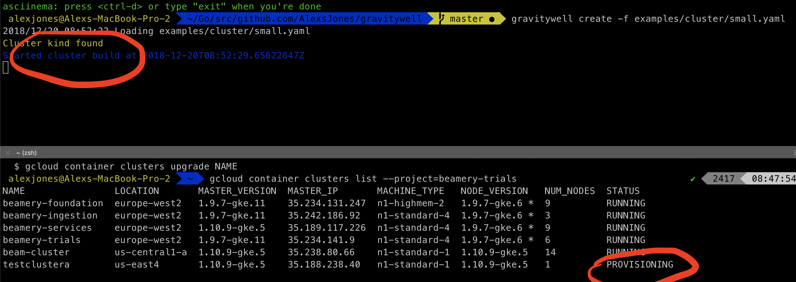
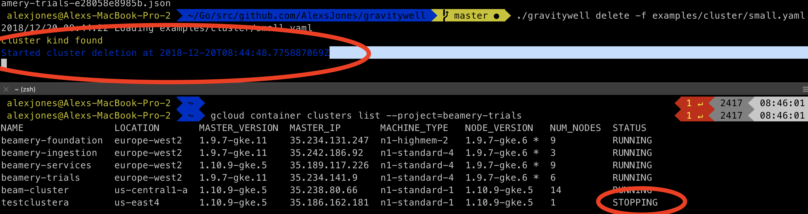

# gravitywell


_Why make this when Helm or Terraform exist?_

No tool I've yet used can deploy concurrently to multiple clusters 
and then parallel deploy their applications

_But terraform can deploy kubernetes applications right?_

Try using it; you'll find an inconsistent experience with only part of the api supported.

---


_What does gravitywell claim to do then?_


- Deploy cluster into GCP from yaml
- Deploy manifests into those clusters from yaml

Pull all your Kubernetes deployment configuration into one place.

Run one command and one manifest to switch clusters, deploy services and be the boss of your infrastructure.

It's as easy as `gravitywell create -f ./`



Or `gravitywell delete -f ./`



## Installation

`go get github.com/AlexsJones/gravitywell`

## Requirements

- Golang 1.10

- `go get github.com/AlexsJones/vortex`
- `export GOOGLE_APPLICATION_CREDENTIALS=somegooglecloudserviceaccountfile.json` (_This needs to be set to a valid service account for the project you with to perform GCP operations on_)


## Example overview Manifest

There are two kinds of manifest.
`Cluster` and `Application`

```
APIVersion: "v1"
Kind: "Cluster"
Strategy:
  - Provider:
      Name: "Google Cloud Platform"
      Clusters:
        - Cluster:
            Name: "testclustera"
            Project: "beamery-trials"
            Region: "us-east4"
            Zones: ["us-east4-a"]
            Labels:
                A: "B"
                Foo: "Bar"
            InitialNodeCount: 1
            InitialNodeType: "n1-standard-1"
            OauthScopes: "https://www.googleapis.com/auth/monitoring.write,
            https://www.googleapis.com/auth/logging.write,
            https://www.googleapis.com/auth/trace.append,
            https://www.googleapis.com/auth/devstorage.full_control,
            https://www.googleapis.com/auth/compute"
            NodePools:
              - NodePool:
                  Name: "Pool-A"
                  Count: 3
                  NodeType: "n1-standard-1"
                  Labels:
                    Foo: "Bar"
            PostInstallHook:
              - Execute:
                  Shell: "gcloud container clusters get-credentials TestClusterA --region=us-east4 --zone=a"
```

```
APIVersion: "v1"
Kind: "Application"
Strategy:
  - Cluster:
      Name: "minikube"
      Applications:
        - Application:
           Name: "kubernetes-nifi-cluster"
           Namespace: "nifi"
           Git: "git@github.com:AlexsJones/kubernetes-nifi-cluster.git"
           Action:
            - Execute:
               Shell: "ls -la"
               Kubectl:
                 Path: statefulset
        - Application:
            Name: "kubernetes-zookeeper-cluster"
            Namespace: "zk"
            Git: "git@github.com:AlexsJones/kubernetes-zookeeper-cluster.git"
            Action:
             - Execute:
                Shell: "./build_environment.sh small"
                Kubectl:
                  Path: deployment

```
Command output `gravitywell create -f examples/`

```
go run main.go create -f examples/       ✔  2846  15:06:38
2019/01/02 15:07:02 Loading examples/
2019/01/02 15:07:02 Loading examples/application
2019/01/02 15:07:02 Loading examples/application/small.yaml
Application kind found
2019/01/02 15:07:02 Loading examples/cluster
2019/01/02 15:07:02 Loading examples/cluster/small.yaml
Cluster kind found
Started cluster build at 2019-01-02T15:07:04.790122357Z
Cluster running
Fetching cluster endpoint and auth data.
kubeconfig entry generated for testclusterb.
WARN[0154] Switching to cluster: gke_beamery-trials_us-east4_testclusterb
DEBU[0154] Loading deployment kubernetes-apache-tika
DEBU[0154] Fetching deployment kubernetes-apache-tika into .gravitywell/kubernetes-apache-tika
Enumerating objects: 45, done.
Total 45 (delta 0), reused 0 (delta 0), pack-reused 45
WARN[0155] Running shell command ./build_environment.sh default
Building for environment default
DEBU[0155] Successful
ERRO[0155] Could not read from file %s.gravitywell/kubernetes-apache-tika/deployment
ERRO[0155] Could not read from file %s.gravitywell/kubernetes-apache-tika/deployment/tika
INFO[0155] Decoded Kind: extensions/v1beta1, Kind=Deployment
INFO[0155] Decoded Kind: /v1, Kind=Namespace
INFO[0155] Decoded Kind: /v1, Kind=Service
Found Namespace resource
DEBU[0156] Namespace deployed
DEBU[0156] Found deployment resource
DEBU[0157] Deployment deployed
DEBU[0157] Found service resource
DEBU[0157] Service deployed
 alexjones@Alexs-MBP-2  ~/Go/src/github.com/AlexsJones/gravitywell   master  kubectl get ns                           ✔  2847  15:09:39
NAME          STATUS   AGE
default       Active   1m
kube-public   Active   1m
kube-system   Active   1m
tika          Active   48s
 alexjones@Alexs-MBP-2  ~/Go/src/github.com/AlexsJones/gravitywell   master  kubectl get pods -n tika                 ✔  2848  15:10:26
NAME                   READY   STATUS              RESTARTS   AGE
tika-db84b854c-45r6p   0/1     ContainerCreating   0          52s
tika-db84b854c-lxj6v   0/1     ContainerCreating   0          52s
tika-db84b854c-qrl8p   0/1     ContainerCreating   0          52s
```

## Commands

_We support four kubectl commands currently_

```
delete
apply
create
replace
```

### Supported Cloud providers

- [x] Google cloud platform 
- [ ] Amazon Web Services

### Supported Kubernetes resource definition types

- [x] ConfigMap
- [x] Secret
- [x] StatefulSet
- [x] Deployment
- [x] DaemonSet
- [x] Service
- [x] PodDisruptionBudget
- [x] ServiceAccounts
- [x] Role
- [x] ClusterRole
- [x] ClusterRoleBinding
- [x] RoleBinding
- [x] StorageClass
- [x] CronJob
- [x] Job
- [x] Ingress
- [ ] PersistantVolume
- [ ] PersistantVolumeClaim

### Roadmap

- [ ] Depends on Cluster from Application flag
