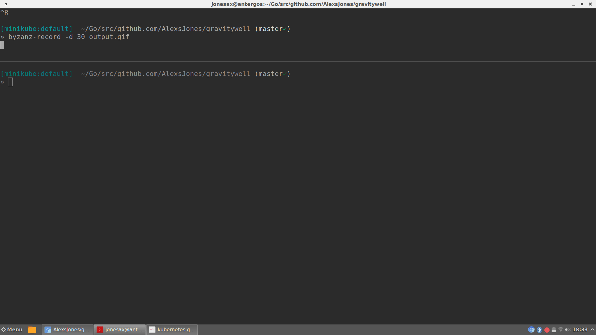

# gravitywell


Pull all your Kubernetes deployment configuration into one place.

Run one command and one manifest to switch clusters, deploy services and be the boss of your infrastructure.

_It's a bit like docker-compose for Kubernetes deployments across clusters!_


_Or using --dryrun to test your deployment status_



## Installation

`go get github.com/AlexsJones/gravitywell`

## Requirements

`go get github.com/AlexsJones/vortex`

## Example overview Manifest

_Please see examples directory_

Example command: `gravitywell -config examples/application/small.yaml`


_We support three kubectl commands currently_

```
replace
apply
create
```

### Command Options

```
  -config string
    	Configuration path
  -dryrun bool
    	Run a dry run deployment to test what is deployment
  -tryupdate bool
    	Try to update the resource if possible
```

### Support APIResource types

- [x] ConfigMap
- [x] StatefulSet
- [x] Deployment
- [x] Service
- [x] PodDisruptionBudget
- [x] ServiceAccounts
- [x] RoleBinding
- [x] CronJob
- [ ] PersistantVolume
- [ ] PersistantVolumeClaim

### Roadmap

- [x] Rationalise back into native API for manifest parsing
- [ ] Expand to deploy from in-memory git repo