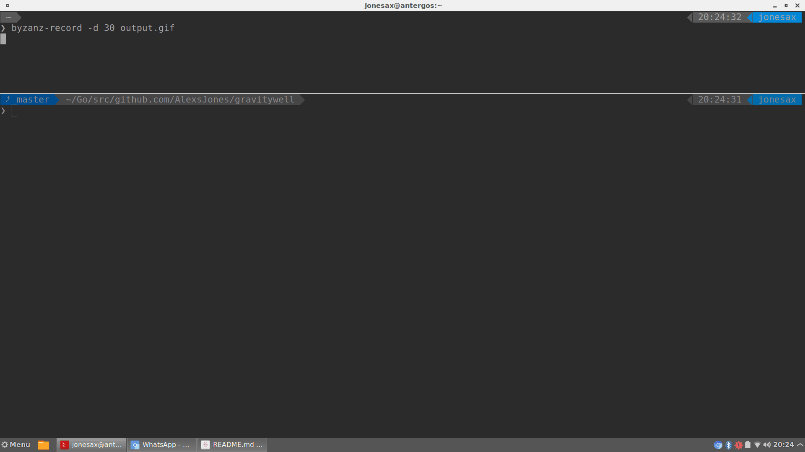

# gravitywell


Pull all your Kubernetes deployment configuration into one place.

Run one command and one manifest to switch clusters, deploy services and be the boss of your infrastructure.

_It's a bit like docker-compose for Kubernetes deployments across clusters!_



_Or using --dryrun to test your deployment status_


## Installation

`go get github.com/AlexsJones/gravitywell`

## Requirements

`go get github.com/AlexsJones/vortex`

## Example overview Manifest

_Please see examples directory_

Example command: `gravitywell -config examples/small`

_Parallel deployments with --parallel flag_

Lets look at the small.yaml...

```
APIVersion: "v1"
Strategy:
  - Cluster:
      Name: "minikube"
      Deployments:
        - Deployment:
           Name: "kubernetes-nifi-cluster"
           Namespace: "nifi"
           Git: "https://github.com/AlexsJones/kubernetes-nifi-cluster.git"
           Action:
            - Execute:
               Shell: "ls -la"
               Kubectl:
                 Command: replace
                 Path: statefulset
        - Deployment:
            Name: "kubernetes-zookeeper-cluster"
            Namespace: "zk"
            Git: "https://github.com/AlexsJones/kubernetes-zookeeper-cluster.git"
            Action:
             - Execute:
                Shell: "./build_environment.sh small"
                Kubectl:
                  Path: deployment
                  Command: replace
````

### Command Options

```
  -config string
    	Configuration path
  -dryrun bool
    	Run a dry run deployment to test what is deployment
  -parallel bool
    	Run cluster scope deployments in parallel
  -tryupdate bool
    	Try to update the resource if possible
```

### Support APIResource types

- [x] ConfigMap
- [x] StatefulSet
- [x] Deployment
- [x] Service
- [x] PodDisruptionBudget
- [ ] CronJob
- [ ] PersistantVolume
- [ ] PersistantVolumeClaim

### Roadmap

- [x] Parallel cluster Deployments
- [x] Rationalise back into native API for manifest parsing
- [ ] Expand to deploy from in-memory git repo
- [ ] Support additional VCS (SVN etc.)
